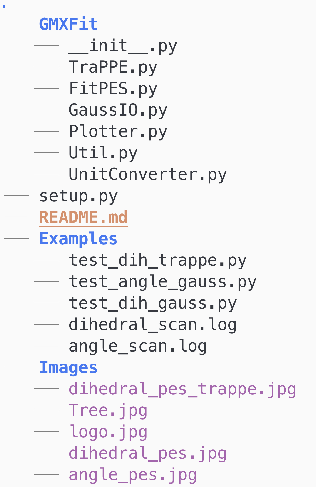
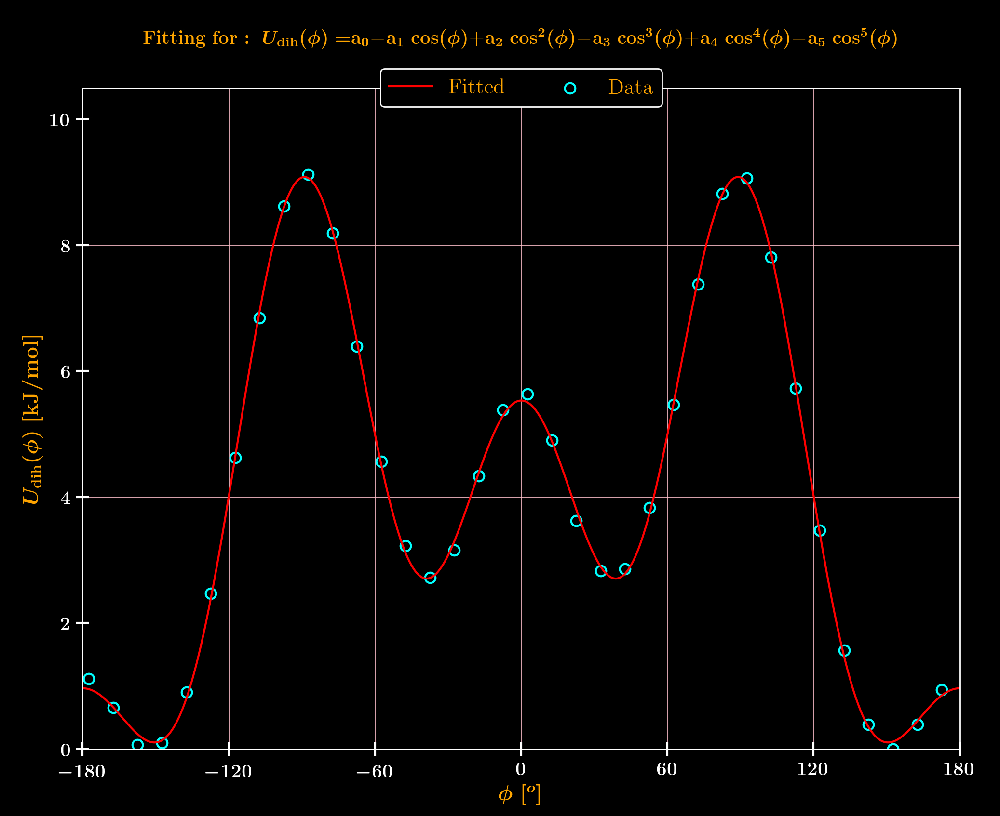
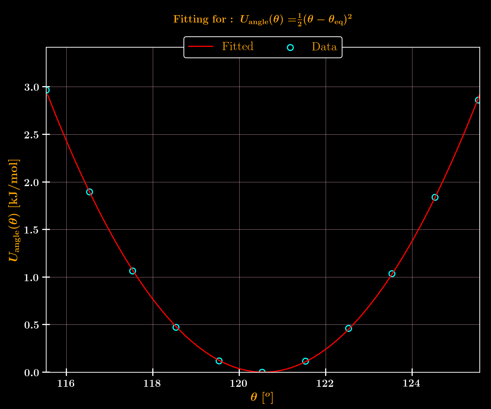
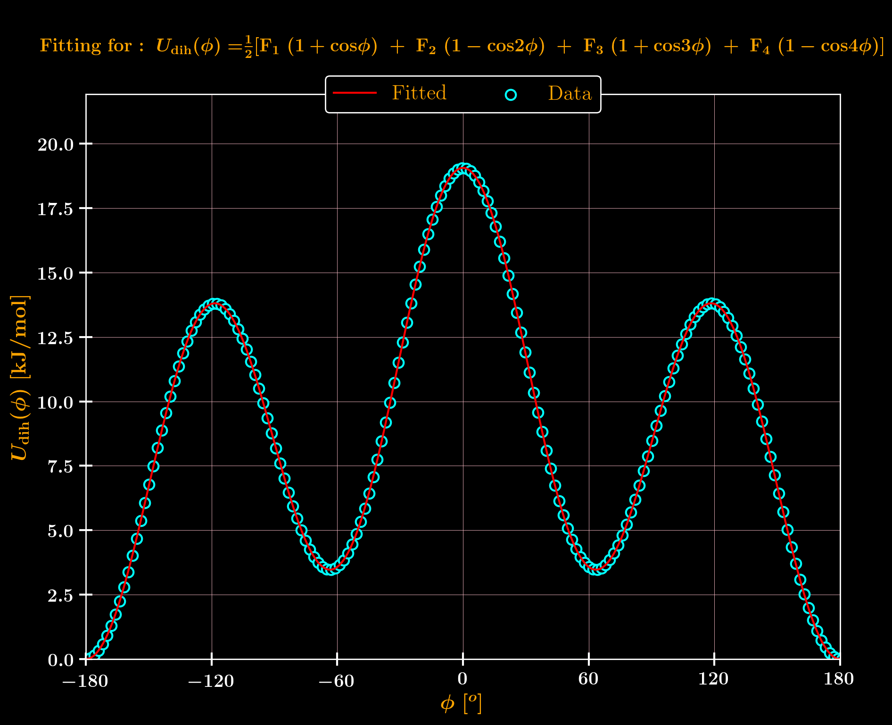

GMXFit
-----
A python toolkit for fitting potential energy surface (PES) into gromacs format. 

&nbsp;
&nbsp;

### Code Organization
---
 

&nbsp;
&nbsp;

### Installation
---
```bash 
git clone https://github.com/masrul/GMXFit 
cd GMXFit
pip install . 
```
&nbsp;
&nbsp;

### Functionalities
---
+ Read Gausssian .log/.out file and parse scanning data 
+ Fit scanning data into gromacs supported functions for
    + Dihedral
    + Angle 

+ Supported dihedral functions,
    + Fourier (DihFourier) 
    + Rychart-Bellman (DihRB)

+ Supported angle function,
    + Harmonic  

+ Convert [TraPPE](http://trappe.oit.umn.edu) force field's function to gromacs format, supported functions, 
    + Cosine-A 
    + Cosine-C 

&nbsp;
&nbsp;

### Usages:
--- 

Neccessary files are located in Examples/. 

**Case-1: Fitting dihedral from gaussian output** 
```python 
from GMXFit.GaussIO import GaussScan
from GMXFit.FitPES import DihedralFit


# Create Data object from gaussian output file
gauss = GaussScan("dihedral_scan.log")

# Pass data object to  PES Fitter
dihFit = DihedralFit(gauss)

# Fit to Rychart-Bellman
dihFit.Fit(fitType="DihRB", drawPES=True)
```

**Result**
```bash 
Scanned dihedral [D20] : 5-4-9-11
o FitType: Rychart-Bellman
o Coefficients: 9.07027814  -0.80408665  -22.42055866  -0.42059325  16.59787317  -1.05822607
o R-sqaure: 0.999
```
|  |
|:--:| 
| **Fig-1:** PES Fitting Gaussian log to Gromacs dihedral form |


&nbsp;
&nbsp;


**Case-2: Fitting angle from gaussian output** 

```python
from GMXFit.GaussIO import GaussScan
from GMXFit.FitPES import AngleFit


# Create Data object from gaussian output file
gauss = GaussScan("angle_scan.log")

# Pass data object to  PES Fitter
angFit = AngleFit(gauss)

# Fit
angFit.Fit()
```

**Result**
```bash 
Scanned angle [A15] : 4-9-11
o FitType: Angle Harmonic
o Force constant: 765.97905760 kJ/mol/nm^2
o Equilibrium angle: 120.56
o R-sqaure: 1.000
```

|  |
|:--:| 
| **Fig-2:** PES Fitting Gaussian log to Gromacs Angle Form |

&nbsp;
&nbsp;

**Case-3: Converting TraPPE dihedral type to gromacs type**

```python
from GMXFit.TraPPE import TrappePES
from GMXFit.FitPES import DihedralFit


# Create a TrappePES object
trappe_pes = TrappePES()

# collect coeffs from TraPPE website/literature
trappe_coeffs = (0.00, 355.03, -68.19, 791.32)
trappe_funType = "CosineA"  # CosineC is also supported

# Pass function type and coeffs to create PES
trappe_pes.createPES(dihType=trappe_funType, coeffs=trappe_coeffs)

# Pass data object to PES Fitter
dihFit = DihedralFit(trappe_pes)

# Fit
dihFit.Fit(fitType="DihFourier", drawPES=True)

```
**Result**
```bash 
o FitType: Fourier
o Coefficients: 5.90355244  -1.13388515  13.15832217  0.00000002
o R-sqaure: 1.000
```

|  |
|:--:| 
| **Fig-3:** PES Fitting TraPPE to Gromacs |

### Copyright 
Masrul Huda (c) 2021
